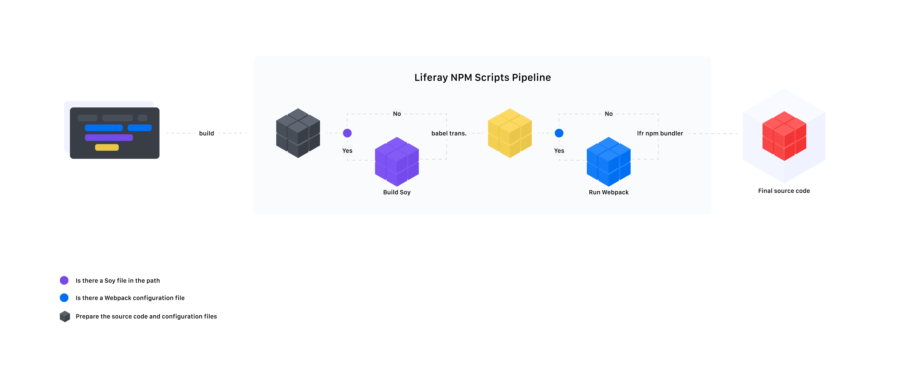

# DXP Build Process

This article describes how the build process works in DXP, with a high-level view that provides a deeper understanding of what goes on behind the scenes, this article does not describe the fine details and there are many links to other articles that discuss in more detail parts of the process.

## Build module

The build pipeline of the source code of the modules in DXP is made by a set of tools that are concentrated in the CLI [liferay-npm-scripts](https://github.com/liferay/liferay-npm-tools/tree/master/packages/liferay-npm-scripts) that abstracts some configurations that would be necessary to perform the build, think of it as a zero-config to start to work.

> `liferay-npm-scripts` does not only deal with the build but also with [formatting](./formatting.md), storybook, theme, test...

Just like a regular JavaScript package, you can add the `liferay-npm-scripts build` task to your `package.json` as a `build` task that can run `yarn build`, by default when `gradlew deploy` is executed, executes the module's `yarn build` as part of the process. All artifacts are added to an OSGi bundle that is later deployed to DXP.

When running `liferay-npm-scripts build` a sequence of execution of other tools takes place, depending on the environment in which it is being run, will trigger other tools (e.g. webpack and Soy).

1. Setup env
2. Validation of the `npmscripts.config.js` file if it exists
3. Build [Soy](http://metaljs.com/docs/guides/soy-components.html#soy_compilation) files, if any
4. Build [Babel](https://babeljs.io/) transformation
5. Run [webpack](https://webpack.js.org/) if the `webpack.config.js` file exists
6. Run [`liferay-npm-bundler`](https://github.com/liferay/liferay-js-toolkit/tree/master/packages/liferay-npm-bundler)
7. Run [`liferay-npm-bridge-generator`](https://github.com/liferay/liferay-js-toolkit/tree/master/packages/liferay-npm-bridge-generator) if it exists `.npmbridgerc`

CLI does a lot for you, like [not having to configure Babel, ESLint, Jest, npm-bundler, Prettier and Stylelint](https://github.com/liferay/liferay-npm-tools/tree/master/packages/liferay-npm-scripts/src/config), you don't need to configure this when using liferay-npm-scripts, you also overwrite these settings by adding the config file of the respective tools, the CLI will take your settings and apply the merge.

### Build Pipeline

Following the sequence we can describe in more detail what happens in each phase briefly.

By default the CLI expects its source code to be in `src/main/resources/META-INF/resources` and is compiled into the `build/node/packageRunBuild/resources` folder.

#### 1. Setup env

Only set `NODE_ENV` to `production`, you can override it by configuring `env NODE_ENV=development liferay-npm-scripts build` but some problems can still be encountered when running in conjunction with gradlew, read the article [Environment](/environment.md#environment) which explains in more detail on this subject.

#### 2. Validate `npmscripts.config.js`

The CLI will validate the `npmscripts.config.js` configuration file looking for required keys, just to avoid errors that are difficult to track later.

> You can read more about the [npmscripts.config.js settings](https://github.com/liferay/liferay-npm-tools/tree/master/packages/liferay-npm-scripts#config) in the [liferay-npm-tools](https://github.com/liferay/liferay-npm-tools) repository.

#### 3. Soy

If there is a `.soy` file in the module, `liferay-npm-scripts` will build Soy templates and then run `babel` on the generated `.js` files and drop it into the build destination folder. Unlike the other phases, before executing the `babel` the Soy build will compile your `.soy` code and drop it into a temporary folder (by default in `build/npmscripts`) until the `babel` can transform and send it to destination folder.

The CLI will run [`metalsoy`](https://github.com/metal/metal-tools-soy/tree/4.x) tool to handle the Soy files.

#### 4. Babel

As part of the build process, [Babel](https://babeljs.io/) is used for transformation, for React with JSX syntax for example and to allow the use of new JavaScript features.

- [Default configuration of Babel in liferay-npm-scripts](https://github.com/liferay/liferay-npm-tools/blob/master/packages/liferay-npm-scripts/src/config/babel.json)

#### 5. Webpack

The CLI can also run [webpack](https://webpack.js.org/) as part of the process if there is a [`webpack.config.js`](https://webpack.js.org/configuration/#options) configuration file.

> The CLI will also merge the [Babel config](https://github.com/liferay/liferay-npm-tools/blob/master/packages/liferay-npm-scripts/src/config/babel.json) with the `webpack.config.js` configuration if the loader `babel-loader` is present in the configuration.

#### 6. Liferay npm bundler

Running [liferay-npm-bundler](https://github.com/liferay/liferay-js-toolkit/tree/master/packages/liferay-npm-bundler) is super important to allow your project's dependencies and source code to be converted from ES5 to AMD and let them be deployed as an OSGI package later. So, Liferay Portal will be able to load the files of your module and its dependencies when requested.

> Read the ["Bundler v2 imports"](/bundler_imports.md) to understand at a technical level why we need it and how it works.

- [Default bundler preset](https://github.com/liferay/liferay-npm-tools/blob/master/packages/liferay-npm-bundler-preset-liferay-dev/config.json)

#### 7. Liferay npm bridge generator

The `liferay-npm-bridge-generator` is only executed when there is a `.npmbridgerc` configuration file on the module, this is an extra step that generates bridge modules (npm modules that re-export another module in the same package) inside a project.

> To learn more about how to use this tool read ["How to use liferay npm bridge generator" in the wike of the liferay-js-toolkit repository](https://github.com/liferay/liferay-js-toolkit/wiki/How-to-use-liferay-npm-bridge-generator).
